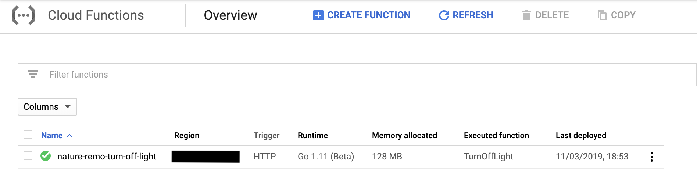
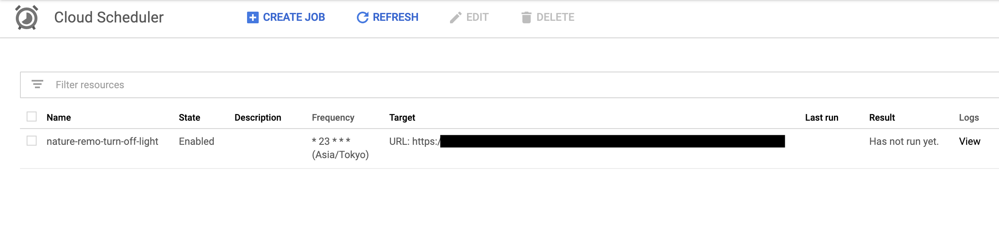
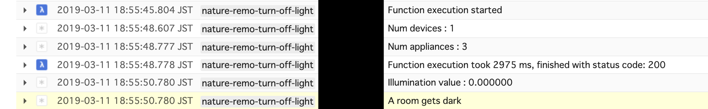

# nature-remo-turn-off-light

Simple Cloud Function to turn off your room's light.

## What this script does?

This script is a simple Cloud Function written in Golang.
It turns off your room's light until it gets dark.

## How to setup?

Check [Writing Cloud Functions |  Google Cloud](https://cloud.google.com/functions/docs/writing/) first.

After you activate cloud function, copy and paste function.go & go.mod in https://console.cloud.google.com/functions with "call via HTTP".



If you want to kick function repeatedly, then use https://console.cloud.google.com/cloudscheduler and create a task like

```
nature-remo-turn-off-light	  * 23 * * *   <target is your function url>
```



If you succeeded in running function, you will get logs like follows


